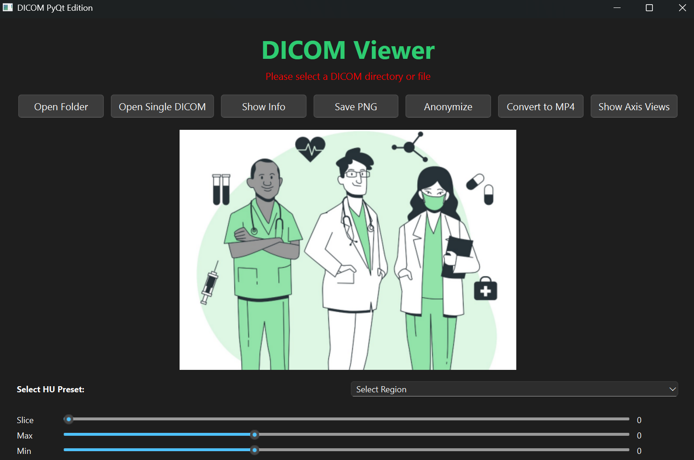
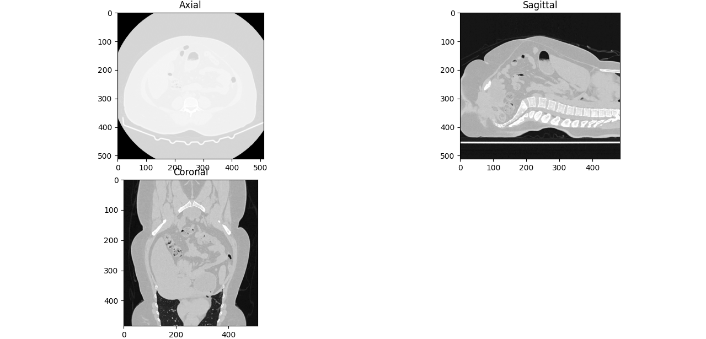

# DICOM Viewer 

## Overview
This project is a **Python-based DICOM Viewer** built with **PyQt6** to visualize and process medical imaging data.  
It demonstrates understanding of:
- DICOM metadata structure,  
- HU (Hounsfield Unit) conversion,  
- Window/level adjustments,  
- Image anonymization,  
- 3D anatomical plane visualization (Axial, Sagittal, Coronal), and  
- DICOM-to-MP4 conversion workflows.

It forms the foundation for upcoming exploration of **ITK**, **VTK**, and **Scikit-Surgery** for 3D reconstruction, segmentation, and surgical simulation.

## Features
-  Open single or multiple DICOMs  
- Apply **region-specific HU presets** (Brain, Lung, Bone, etc.)  
- Navigate slices using a **slider**  
- Adjust **min–max HU window** dynamically  
- Display complete **DICOM metadata**  
- **Anonymize** patient data for research safety  
- Export slices as **PNG images**  
- Convert series to **MP4 video**  
- Visualize **Axial, Sagittal, Coronal** anatomical views  
- Smooth, modern UI built with **PyQt6** and **Pillow**

## Tech Stack
- **UI:** PyQt6, ttkbootstrap (optional)
- **Imaging:** pydicom, OpenCV, Pillow, NumPy
- **Visualization:** Matplotlib
- **(Future):** ITK, VTK, Scikit-Surgery

## Project Structure
```
DICOM-Viewer/
├── PYdicom.ipynb            #Pydicom collab notebook                  
├── app.py                   # Main PyQt6 interface
├── app_functions.py         # Metadata & anonymization
├── axis.py                  # Axial, sagittal, coronal visualization
├── dicom_3d_to_mp4.py       # Converts 3D DICOM to MP4
├── requirements.txt
├── doc.png              # UI background   
└── README.md
```

## Installation
```bash
git clone <your-repo-url>
cd DICOM-Viewer
pip install -r requirements.txt
python app3.py
```

## 🖼️ Screenshots

### Main Viewer UI


### HU Preset Example (Abdomen)


### Axial–Coronal–Sagittal Views
 

## Future Roadmap
| Phase | Goal | Tools | Description |
|-------|------|-------|--------------|
| ✅ Phase 1 | DICOM Viewer | PyQt6, pydicom, OpenCV | Core viewer with anonymization & visualization |
| 🔜 Phase 2 | 3D Volume Rendering | VTK | Add interactive 3D rendering in PyQt |
| 🔜 Phase 3 | Image Registration & Segmentation | ITK / SimpleITK | Implement 3D segmentation & registration |
| 🔜 Phase 4 | Surgical Simulation | Scikit-Surgery | Integrate real-time surgical navigation tools |
| 🔜 Phase 5 | Research Report / Publication | Jupyter / PDF | Create documentation and evaluation |

## Learning Outcomes
- Deep understanding of **DICOM structure and metadata**
- Knowledge of **HU scaling, min–max windowing**, and **CT visualization**
- Basics of **3D anatomical reconstruction**
- Foundations for **medical image registration and segmentation**

## Author
**Md Farhan Naushad**  


---
