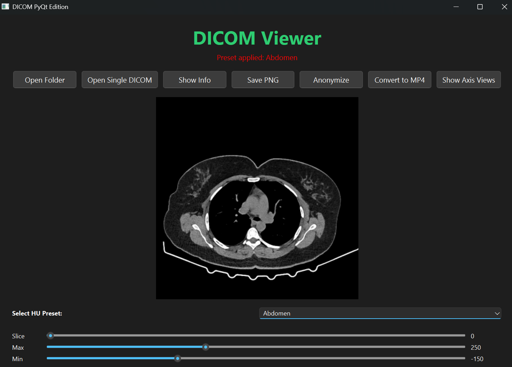

# DICOM Viewer 

## Overview
This project is a **Python-based DICOM Viewer** built with **PyQt6** to visualize and process medical imaging data.  
It demonstrates understanding of:
- DICOM metadata structure,  
- HU (Hounsfield Unit) conversion,  
- Window/level adjustments,  
- Image anonymization,  
- 3D anatomical plane visualization (Axial, Sagittal, Coronal), and  
- DICOM-to-MP4 conversion workflows.

It forms the foundation for upcoming exploration of **ITK**, **VTK**, and **Scikit-Surgery** for 3D reconstruction, segmentation, and surgical simulation.

## Jupyter / Colab Notebook

### Introduction  
This notebook — **`Pydicom.ipynb`** — documents my learning journey with the pydicom library for working with DICOM (Digital Imaging and Communications in Medicine) files.  
DICOM is the global standard format for storing and transmitting medical imaging data such as MRI, CT, and X-ray scans.

Through this notebook, I explore how to:  
- Read and inspect DICOM metadata  
- Display medical images  
- Modify and anonymize patient information  
- Save and export DICOM files

### Notebook Access  
You can view or run the notebook interactively on Google Colab:

[](https://colab.research.google.com/github/farhannaushad08/AI-HealthCare/blob/main/Pydicom/Pydicom.ipynb)


## Features
-  Open single or multiple DICOMs  
- Apply **region-specific HU presets** (Brain, Lung, Bone, etc.)  
- Navigate slices using a **slider**  
- Adjust **min–max HU window** dynamically  
- Display complete **DICOM metadata**  
- **Anonymize** patient data for research safety  
- Export slices as **PNG images**  
- Convert series to **MP4 video**  
- Visualize **Axial, Sagittal, Coronal** anatomical views  
- Smooth, modern UI built with **PyQt6** and **Pillow**

## Tech Stack
- **UI:** PyQt6, ttkbootstrap (optional)
- **Imaging:** pydicom, OpenCV, Pillow, NumPy
- **Visualization:** Matplotlib
- **(Future):** ITK, VTK, Scikit-Surgery

## Project Structure
```
DICOM-Viewer/
├── PYdicom.ipynb            #Pydicom collab notebook                  
├── app.py                   # Main PyQt6 interface
├── app_functions.py         # Metadata & anonymization
├── axis.py                  # Axial, sagittal, coronal visualization
├── dicom_3d_to_mp4.py       # Converts 3D DICOM to MP4
├── requirements.txt
├── doc.png              # UI background   
└── README.md
```

## Installation
```bash
git clone <your-repo-url>
cd DICOM-Viewer
pip install -r requirements.txt
python app3.py
```

## 🖼️ Screenshots

### Main Viewer UI


### HU Preset Example (Abdomen)


### Axial–Coronal–Sagittal Views
 

## Future Roadmap
| Phase | Goal | Tools | Description |
|-------|------|-------|--------------|
| ✅ Phase 1 | DICOM Viewer | PyQt6, pydicom, OpenCV | Core viewer with anonymization & visualization |
| 🔜 Phase 2 | 3D Volume Rendering | VTK | Add interactive 3D rendering in PyQt |
| 🔜 Phase 3 | Image Registration & Segmentation | ITK / SimpleITK | Implement 3D segmentation & registration |
| 🔜 Phase 4 | Surgical Simulation | Scikit-Surgery | Integrate real-time surgical navigation tools |
| 🔜 Phase 5 | Research Report / Publication | Jupyter / PDF | Create documentation and evaluation |

## Learning Outcomes
- Deep understanding of **DICOM structure and metadata**
- Knowledge of **HU scaling, min–max windowing**, and **CT visualization**
- Basics of **3D anatomical reconstruction**
- Foundations for **medical image registration and segmentation**

## Author
**Md Farhan Naushad**  


---
